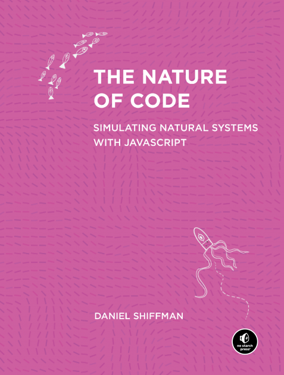

# About The Project

This directory contains all my coding examples, expirements, and learning exercises as i read through Daniel Shiffman's [*The Nature of Code*](https://natureofcode.com/). Most examples are based on the book, though some may deviate as i try to implement things my own way, or expirement a bit further. 

    

## Setup

P5.js can be easily setup either through a VS Code extension or by using the P5 web editor (requires an account). You can [follow the official P5 setup guide](https://p5js.org/tutorials/setting-up-your-environment/) to get started. 

For my purposes i will mainly use the VS Code extension as it will allow me to track changes with git/github, and work offline. In addition, I'll also be porting some examples to the P5 web editor so that i can share live demos that you can quickly view in your browser.

## Demos
* [Bouncing Ball](https://editor.p5js.org/juzier/full/K0bxs4ut_)
* [Vector Subtraction](https://editor.p5js.org/juzier/full/txR8g_QMF)
* [Vector Multiplication](https://editor.p5js.org/juzier/full/1D29vg1ph)
* [Vector Normalization](https://editor.p5js.org/juzier/full/dqLIvB5kQ)
* [Motion: Velocity](https://editor.p5js.org/juzier/full/VWr25sU6S)
* [Motion: Acceleration](https://editor.p5js.org/juzier/full/pho4HNEx5)
* [Motion: Acceleration (Car)](https://editor.p5js.org/juzier/full/0xgs-u_ov)
* [Motion: Perlin Noise](https://editor.p5js.org/juzier/full/7Z8Z3NpK1)
* [Forces: Balloon Exercise](https://editor.p5js.org/juzier/full/hjpu2BgNS)
* [Forces: Interactive Particle Phsyics](https://editor.p5js.org/juzier/full/3BSYDWZqT)
* [Friction: Fluid Resistance](https://editor.p5js.org/juzier/sketches/rb9tqa9Au)
* [Forces: Gravitational Attraction](https://editor.p5js.org/juzier/sketches/ByQxIcOL_)
* [Forces: Two Body Problem](https://editor.p5js.org/juzier/sketches/tpyputVaa)